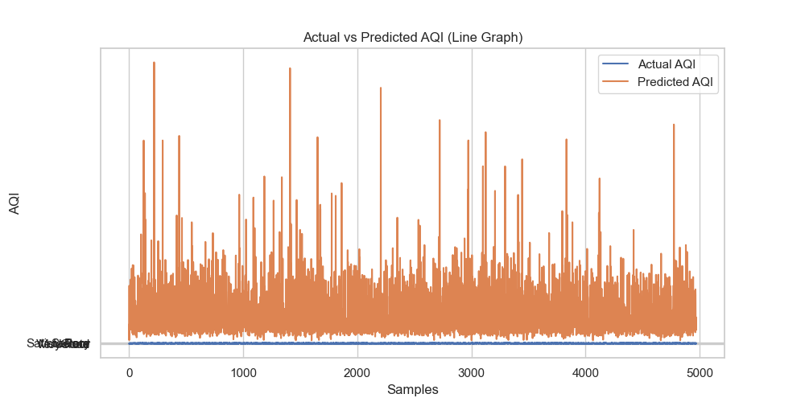
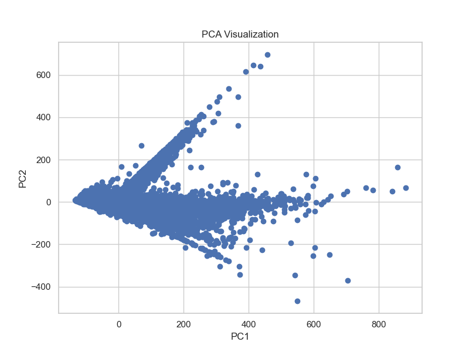

#  Aastha Kedia - Data Science Portfolio

##  About Me
I am a BCA student at VIT Vellore with a strong interest in Data Science, Machine Learning, and Data Analytics. I enjoy working with real-world datasets to extract insights and build predictive models.

---

##  Skills
-  Python  
-  Data Analysis (Pandas, NumPy)  
-  Data Visualization (Matplotlib, Seaborn)  
-  Machine Learning (Scikit-learn)  
-  SQL (Basics)  

---

##  Projects

###  Air Quality Index Prediction using Machine Learning
- Performed complete EDA on air pollution dataset  
- Engineered features like Year, Month, Season, Hour  
- Built Random Forest model for AQI prediction  
- Visualized trends using heatmaps, seasonal graphs, and prediction plots  

 **Project Link:**  
https://github.com/aasthakedia1205-cloud/AQI_PREDICTION-ML

---

##  Key Visualizations

###  AQI Prediction (Actual vs Predicted)

###  Correlation Heatmap

### PCA Visualization

---

##  Achievements
- Built end-to-end Machine Learning project  
- Strong understanding of EDA & data visualization  
- Experience with real-world environmental dataset  

---

## Career Goal
To become a Data Scientist and work on impactful real-world problems using data and AI.

---

## Contact
- Email: aasthakedia1205@gmail.com  
- GitHub: https://github.com/aasthakedia1205-cloud  

---
